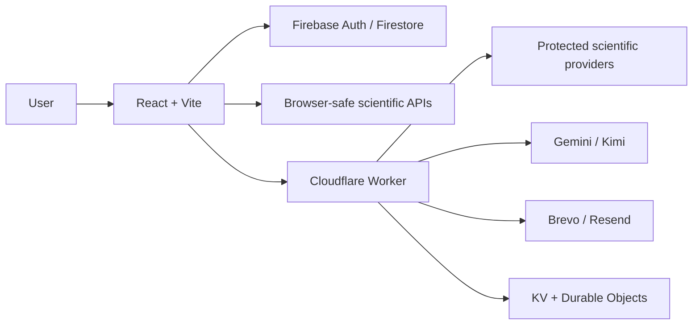
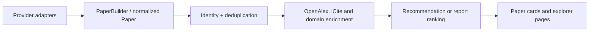

# PaperTok Architecture

## Overview

PaperTok is a React single-page application deployed on GitHub Pages with a Cloudflare Worker
for secret-bearing and server-side integrations.

## Frontend

`src/App.jsx` defines the authenticated routes:

- `/`: personalized For You feed
- `/research`: scientific report and trends
- `/following`: ranked feed from followed entities
- `/search`: cross-entity search
- `/lists`: personal reading library
- `/settings`: account and recommendation preferences
- `/explorer/:type/:id`: authors, institutions, projects, topics, and concepts

Application providers are user-scoped in this order:

1. authentication
2. interface language
3. followed entities
4. followed updates
5. email notifications
6. feed and recommendation state

## Paper Pipeline

Provider-specific payloads should not leak into components when a normalized field exists.
Stable DOI, arXiv, OpenAlex, or provider IDs drive identity. Title-based matching is a final
fallback.

The recommendation engine combines bounded signals for explicit preferences, learned
affinity, followed entities, recency, citations, semantic relevance, exploration, and
diversity.

## Persistence

- Firebase Authentication owns user identity.
- Firestore stores profiles, follows, interactions, preferences, and reading data.
- Browser storage is used only for bounded caches and must be namespaced by user when it
  contains personalized state.
- Cloudflare KV stores notification state. Atomic AI and protected-provider request quotas use
  a Durable Object ledger keyed by bounded UTC periods and hashed user identifiers.
- Scheduled digests query native arXiv categories directly before falling back to OpenAlex,
  avoiding the indexing delay for newly submitted physics and mathematics papers.
- AI explanations bound PDF acquisition and provider retries within the browser request
  deadline, while provider JSON is normalized before LaTeX-aware rendering.
- The Kimi budget ledger uses a Durable Object for atomic monthly reservations.
- Provider-backed Worker routes verify Firebase identity and use canonical cache keys before
  spending protected API quota. A canonical key is built from the values the handler is about to
  send upstream, never from the ones that arrived: those differ everywhere — a limit is clamped, a
  DOI is lowercased, an unlisted filter is dropped, a value is trimmed — and keying on the raw ones
  makes every variant of a discarded parameter a fresh miss for one identical upstream call.
- Billed OpenAlex spend is bounded per minute and per day, in proportion to the calls each route
  makes. A degraded answer — a fallback taken because the primary provider refused, a graph
  assembled after an upstream failed — is cached for two minutes rather than for its normal TTL, so
  a one-second hiccup cannot own a cache entry for six hours or seven days.

## Worker

The Worker entry point is `worker/report-api.js`. Its route groups include:

- health and locale: `/health`, `/health/email`, `/health/ai`, `/locale`
- discovery: `/report/trends`, `/related`, `/citation-graph`, `/arxiv`
- open access: `/oa`
- specialist sources: `/sources/*`
- biomedical metrics: `/enrich/icite`
- associated AI resources: `/resources/huggingface`
- AI: `/ai/explain`
- notifications: `/notifications/*` (authenticated preferences include the active `es`/`en` locale used by digest and unsubscribe copy)

The browser calls the Worker through `VITE_PAPER_API_BASE_URL`. Worker credentials are stored
with `wrangler secret put`.

OpenReview and Hugging Face contribute optional AI and computer-science candidates. NIH iCite
enriches PubMed-indexed candidates in one bounded batch and never blocks the feed when the
service is unavailable. Hugging Face model and dataset links are loaded only for papers whose
normalized provenance includes Hugging Face.

## Deployment

- A push to `main` runs `.github/workflows/deploy.yml` and publishes `dist/` to GitHub Pages.
- The locked Worker CLI is validated with `npm run worker:deploy:dry-run` and deployed separately
  with `npm run worker:deploy`.
- For a contract change, deploy and verify GitHub Pages first, then deploy the Worker. Roll back
  the Worker before the frontend if verification fails. This ordering keeps the currently deployed
  browser compatible while authenticated Worker routes are introduced.
- Firestore rules are deployed explicitly with
  `npx --yes firebase-tools@15.26.0 deploy --only firestore:rules --project papertok-168df`.
