# PaperTok 0.2

**August 27, 2026** · The release where the redesign became the whole app.

PaperTok 0.1 proved the idea: science, one paper at a time, in a feed that respects your attention. Version 0.2 is about everything around that idea. The visual language that began with **Samuel's initial UI redesign** now runs through every screen — and on top of it, the app learned to work in the dark, the reader learned to take notes and answer questions, Research learned to compose itself like a newspaper, and every paper learned to show you where it sits in the literature.

Here is what's new.

---

## A new face, on every screen

The editorial redesign — serif headlines, ruled sections, monospace labels, one accent of yellow — is no longer just the feed. Lists, Research, the reader, search, profiles, settings and the public pages all speak the same language now. The feed card itself got sharper: **up to four figure clippings from the actual paper** drift around the sheet, tilted at angles derived from the paper's identity (they never jump on re-render, and they never appear until the image has truly loaded). The field glyph stays put even when figures arrive, and the abstract opens and closes with one deliberate motion — the sheet itself never scrolls out from under you.

This visual direction grew out of the initial UI redesign by **Samuel** — 0.2 is that design, carried to its conclusion.

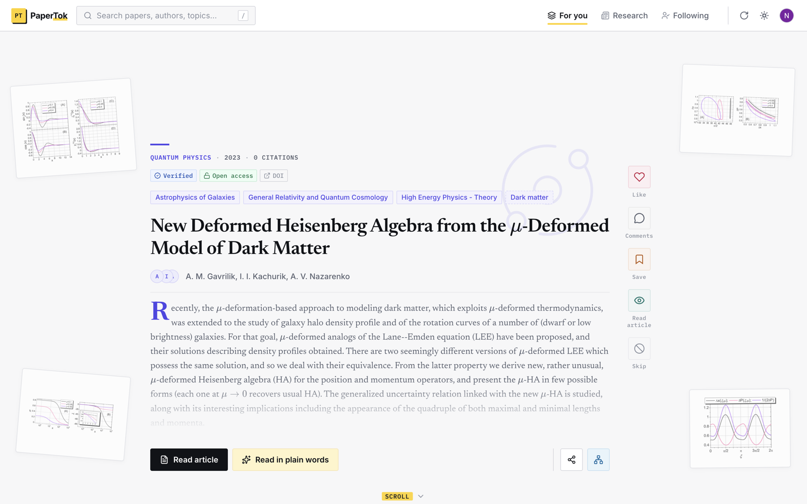

## Dark mode

Press the sun in the navbar and the new theme opens as a circle from the button itself, sweeping the page. Until you choose, PaperTok follows your system — if your laptop goes dark at dusk, so does the app. Once you pick a side, the choice is remembered per device. The theme is decided before the first paint, so there is no white flash on load, and on your phone the browser bar tints to match.

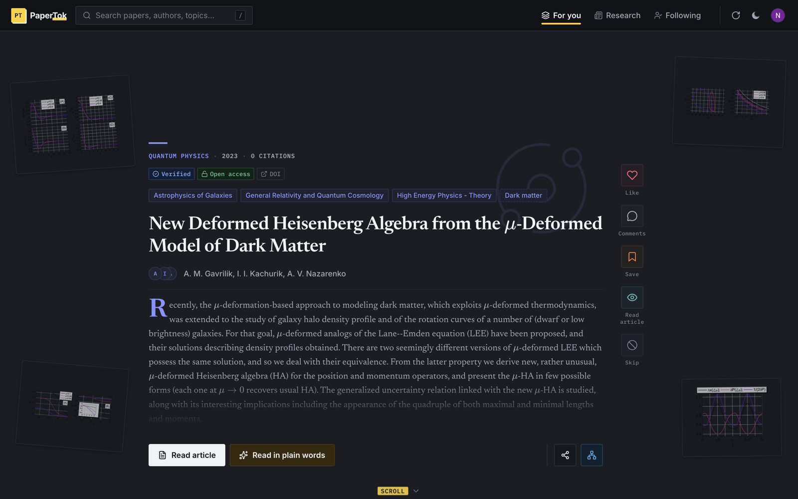

## The reader is now a workbench

"Read in plain words" already rewrote papers at three levels — Beginner, University, Researcher. In 0.2 the reader grew hands.

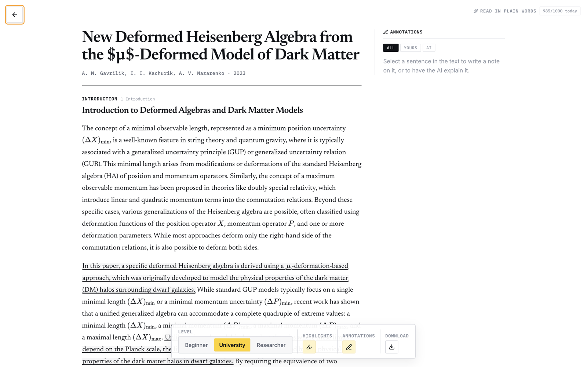

**Select any passage** and a small menu appears right over it with three ways out: **Highlight**, **Write a note**, or **Explain this to me**. The AI option states its price before you spend it — "1 use", with your remaining daily allowance right below — and if the model fails or takes too long, the use is refunded.

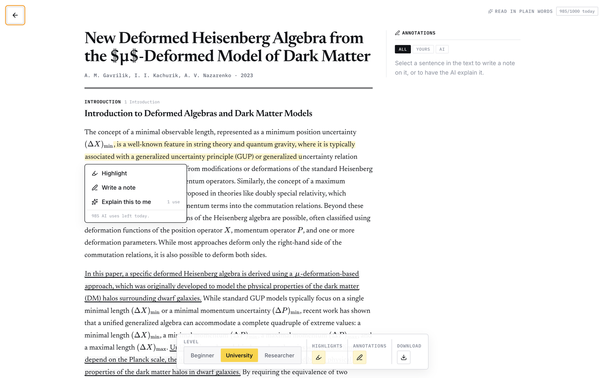

Everything you make lands in the **Annotations rail**: your notes carry a yellow rule, AI explanations carry an ink one, and each card shows the quoted passage, where it lives ("Introduction · §1" — click it and the reader jumps back there), and filters for **All / Yours / AI**. Annotations are saved per paper, per account, and are waiting for you when you come back.

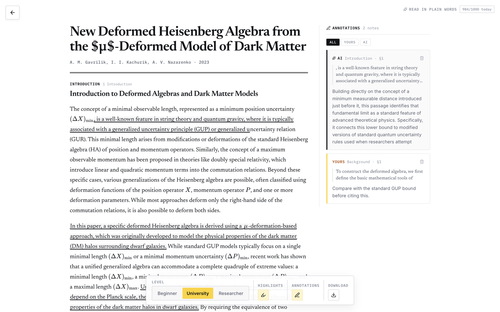

## Take it with you: export to LaTeX

The reader's Download button opens an export card where you choose what travels with the text: your highlights, your notes, the AI annotations — each with its count, and a live sketch of the compiled page that updates as you tick the boxes. One thing is not optional: the title, the authors, the link to the original, and the notice that an AI wrote the rewrite always ship with the file. The result is a `.tex` that compiles with pdfLaTeX as-is.

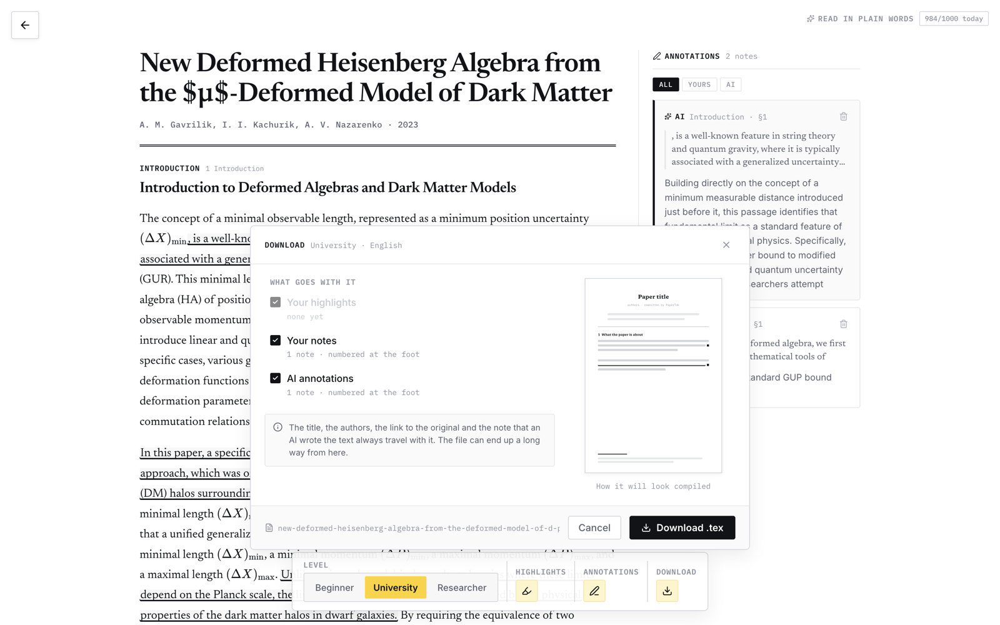

## Research composes itself like an edition

The Research tab (the old Report, which now redirects) lays out its highlights like the front section of a newspaper: a lead story, strips, blocks and briefs on a six-column measure, each cell carrying its field color, year and standfirst. The composition is seeded from the edition's identity — the same edition always lays out the same way, and the next one differently — and space for figures is reserved before the images arrive, so the page never reflows under your eyes.

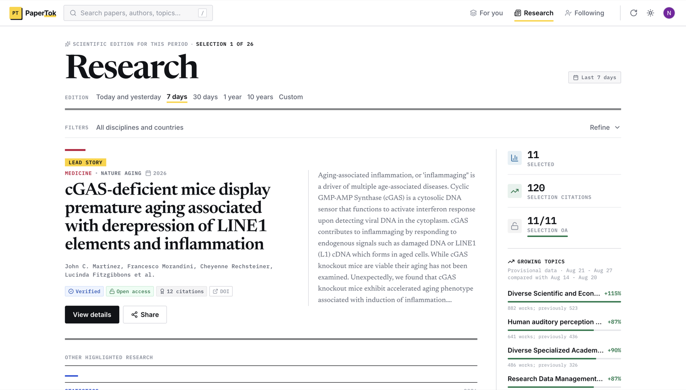

Two more things the edition learned:

- **Batches, not cutoffs.** Selections now page in batches of eleven with a proper closing at the foot of each — "End of batch 2 · Read batch 3 · 340 ranked candidates" — instead of silently truncating at ten. The order is a stable cut: walk to batch 4 and back, and batch 1 is exactly as you left it.
- **A custom period.** Next to *Today and yesterday / 7 days / 30 days / 1 year / 10 years* there is now **Custom**: drag a year range on a rail from 1950 to today, and if both ends land on the same year, a three-month calendar unfolds to pick exact days.

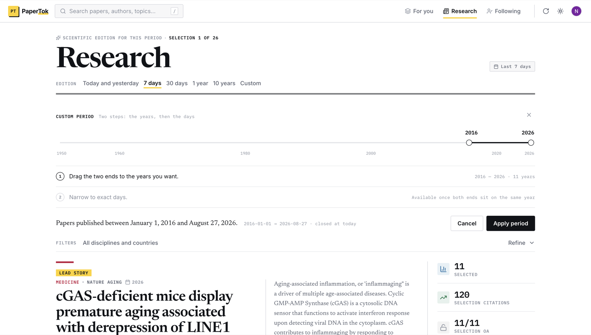

## Every paper shows its neighborhood

Papers with a DOI, arXiv or Semantic Scholar identifier get a new button on the card: **Paper connections**, with a citation map. The paper sits on a timeline rule — **above it, what it cites; below it, what cites it** — with citation counts on a logarithmic axis. Tap a node for its card, open it, or **re-center the map on it** and walk the graph, leaving a breadcrumb trail to find your way back. Works with unknown years or counts are never invented into a position: they are counted honestly as "+N without data" and listed in the alternate list view. Citation data comes from OpenCitations.

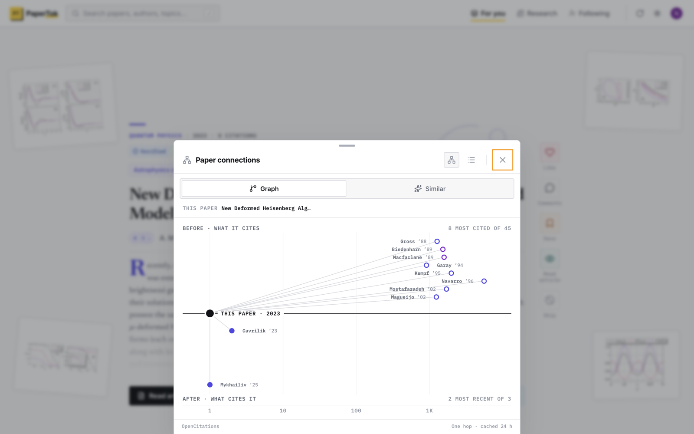

## Search that always lands somewhere

Press `/` anywhere and the palette opens, grouping results into papers, PaperTok users, authors, institutions, topics and funded projects. The fix that matters: **every row now leads to a real destination**. A paper opens its public page — the same address the share button hands out — pre-loaded, instantly. Authors, institutions, topics and projects open their explorer profiles. Nothing dead-ends in "entity not found" anymore.

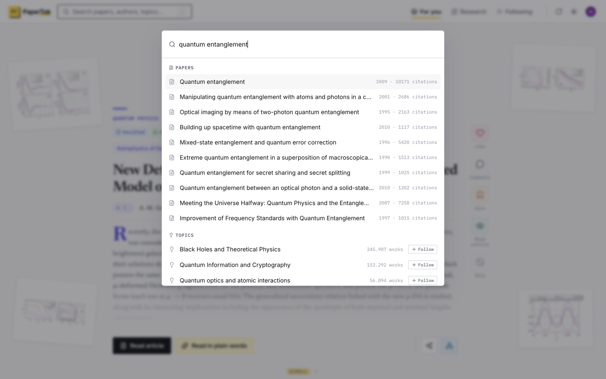

## The explorer got manners

Author, institution, topic and project profiles were converted to the new design — field-tinted headers, compact stats beside Follow, an ORCID card for authors, a Wikipedia summary for institutions. The subtler work is in the waiting: the loading skeleton now **has the shape of the entity you are about to see** (an author reserves room for their ORCID card, an institution for its credentials), so nothing jumps when the data arrives — and the skeleton announces itself to screen readers, which previously heard an empty page.

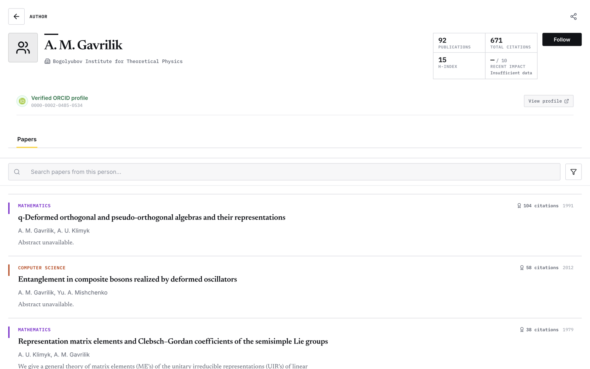

## Lists, in color

Your library got color. Each list carries one of **eight colors** — visible as the spine of its card, in its header, and on your public profile. Pick one when creating a list, change it any time, or keep the one assigned at random. Lists created before 0.2 get a stable color derived from their identity, the same on all your devices.

The palette is not eight colors somebody liked: it is generated under three constraints — one shared lightness so the family reads as a family, chroma capped so list colors never out-shout the field colors that carry meaning, and a minimum 4.5:1 contrast on white so any color can become a label later without a rethink.

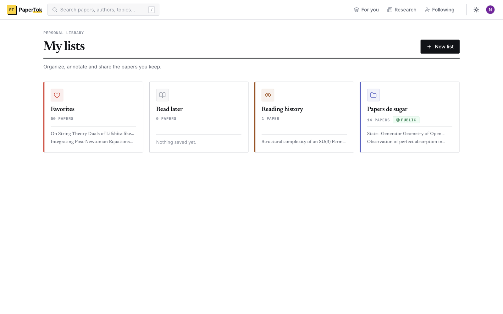

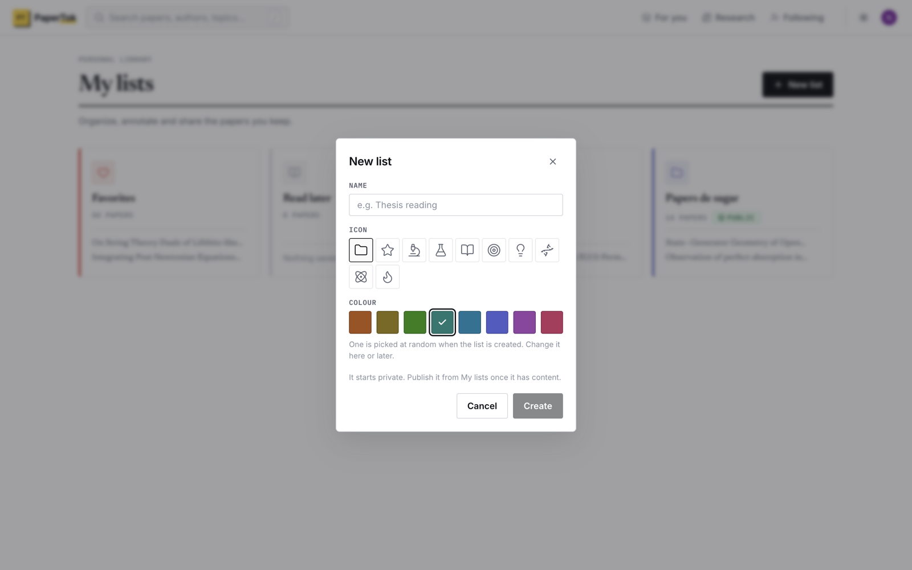

## Labels that tell the truth

Every card now answers the two questions worth asking before reading anything: **has this been peer-reviewed** ("Preprint" in amber, "Verified" in blue) **and can I actually read it** ("Open access", "Open version" when the published copy is paywalled but a free one exists, or "Subscription"). When the record doesn't say, PaperTok shows nothing rather than guessing — a preprint without review metadata used to slip by unlabeled, which was exactly the case that most needed the warning.

## A proper welcome

Onboarding was rebuilt as three named steps — **Areas, Categories, Your feed** — with a rail that shows where you are. Every choice is counted out loud ("1 area · 21 categories"), the footer explains *why* a button is disabled instead of just disabling it, and the final step is a receipt: a table of what you chose, per area, saved to your profile, with the reminder that all of it can change later in Settings.

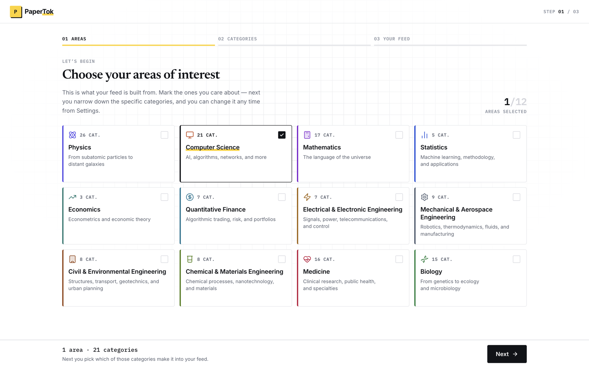

## Put it on your home screen

PaperTok is now installable. Add it from your browser and it opens standalone — no URL bar, its own icon, the system bar tinted to your theme. New icons ship at every size Android and iOS ask for, including a maskable one that survives the circle crop. One honest note: there is no offline mode yet — installed, it looks like an app and still needs the network like one.

## Under the hood

Less visible, but load-bearing:

- **AI usage is a ledger, not a hope.** Reservations are made before the model runs and released if it fails, the daily allowance is enforced server-side, and the meter in the reader always tells you where you stand.
- **The interface waits honestly.** Placeholders are shaped like what they replace, delayed long enough not to flicker, and every external read has a deadline.
- **1,543 automated tests** run on every change, including a suite that compiles the exported LaTeX, one that audits every analytics event against a registry, and one that keeps the citation map's styles from going orphan.

---

## Credits

- **Nicolás Muñoz García** — product, direction, and the stubbornness to measure before shipping.
- **Samuel** — the initial UI redesign that set the visual direction 0.2 carries through the whole app.
- Built with **Claude** as pair programmer.

*PaperTok 0.2 · August 2026*
